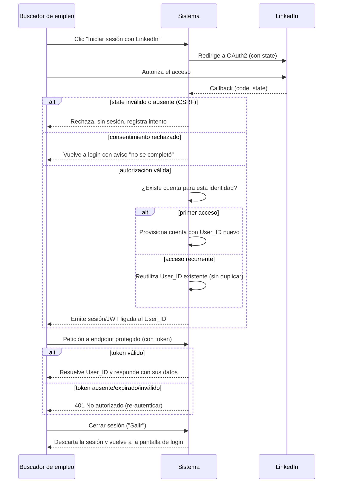

# Flow 001 — Autenticación e Identidad (LinkedIn OAuth2)

## Resumen

Actor: **Buscador de empleo**. Objetivo: entrar al sistema con LinkedIn sin contraseñas, con provisión automática de cuenta en el primer acceso y una sesión ligada a su `User_ID`. Condición de éxito: el usuario queda autenticado y toda petición posterior porta su identidad.

## Diagrama

## Trazabilidad

| Paso | HU | AC |
|---|---|---|
| Login OAuth2 exitoso | HU-001 | AC-1 (happy) |
| state inválido (CSRF) | HU-001 | AC-3 (edge) |
| Consentimiento rechazado | HU-001 | AC-2 (error) |
| Provisión en primer acceso | HU-002 | AC-1 (happy) |
| Acceso recurrente no duplica | HU-002 | AC-3 (edge) |
| Fallo al persistir cuenta | HU-002 | AC-2 (error) |
| Petición autenticada resuelve User_ID | HU-003 | AC-1 (happy) |
| Token ausente/inválido → 401 | HU-003 | AC-2 (error) |
| Token expirado → 401 | HU-003 | AC-3 (edge) |
| Cerrar sesión vuelve al login | HU-021 | AC-1 (happy) |
| Tras salir no se vuelve al área autenticada | HU-021 | AC-2 (error) |
| La sesión no sobrevive al cierre de la pestaña | HU-021 | AC-3 (edge) |

## Notas

Las 4 HU de EP-001 quedan cubiertas (HU-021 se añadió durante la construcción: el prototipo aprobado incluía el botón "Salir" sin historia que lo respaldara). El ramal de error "fallo al persistir cuenta" (HU-002 AC-2) se resuelve dentro del paso de provisión: si la persistencia falla, no se emite sesión.
