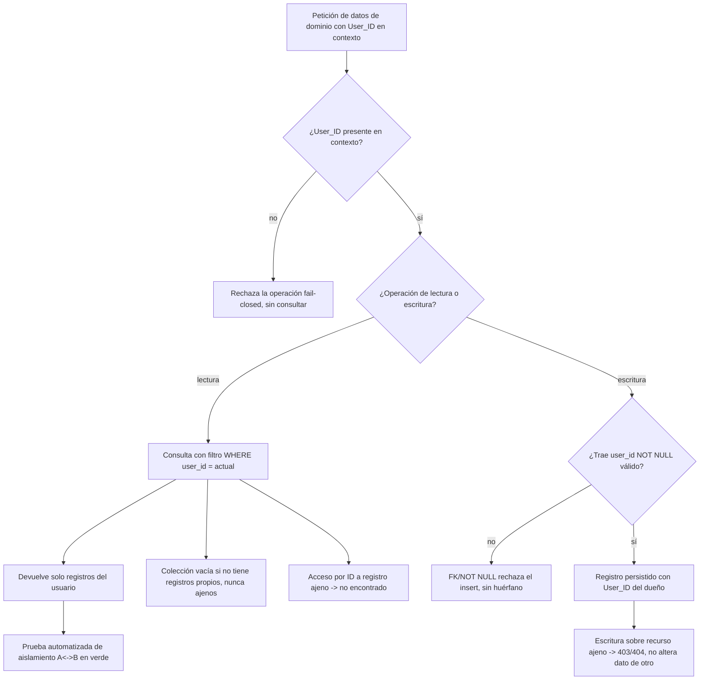

# Flow 002 — Aislamiento Multi-tenant y Modelo de Datos

## Resumen

Actor: **Buscador de empleo** (dueño de sus datos). Objetivo: que toda operación de datos de dominio quede marcada y filtrada por su `User_ID`, con una guarda que falla-cerrado. Condición de éxito: ningún usuario puede leer ni modificar datos de otro (KPI O3: fugas = 0).

## Diagrama

## Trazabilidad

| Paso | HU | AC |
|---|---|---|
| Insert con User_ID del dueño | HU-004 | AC-1 (happy) |
| Insert sin User_ID rechazado | HU-004 | AC-2 (error) |
| Borrado/FK sin huérfanos | HU-004 | AC-3 (edge) |
| Lectura devuelve solo lo propio | HU-005 | AC-1 (happy) |
| Acceso por ID a registro ajeno → no encontrado | HU-005 | AC-2 (error) |
| Colección vacía no filtra al usuario equivocado | HU-005 | AC-3 (edge) |
| Prueba de aislamiento A↔B pasa | HU-006 | AC-1 (happy) |
| Escritura sobre recurso ajeno → 403/404 | HU-006 | AC-2 (error) |
| Petición sin User_ID → guarda fail-closed | HU-006 | AC-3 (edge) |

## Notas

Épica de cimiento transversal (no visible en el journey del usuario). El flow modela la ruta interna de una operación de datos a través de la guarda de tenant. Las 3 HU quedan cubiertas.
