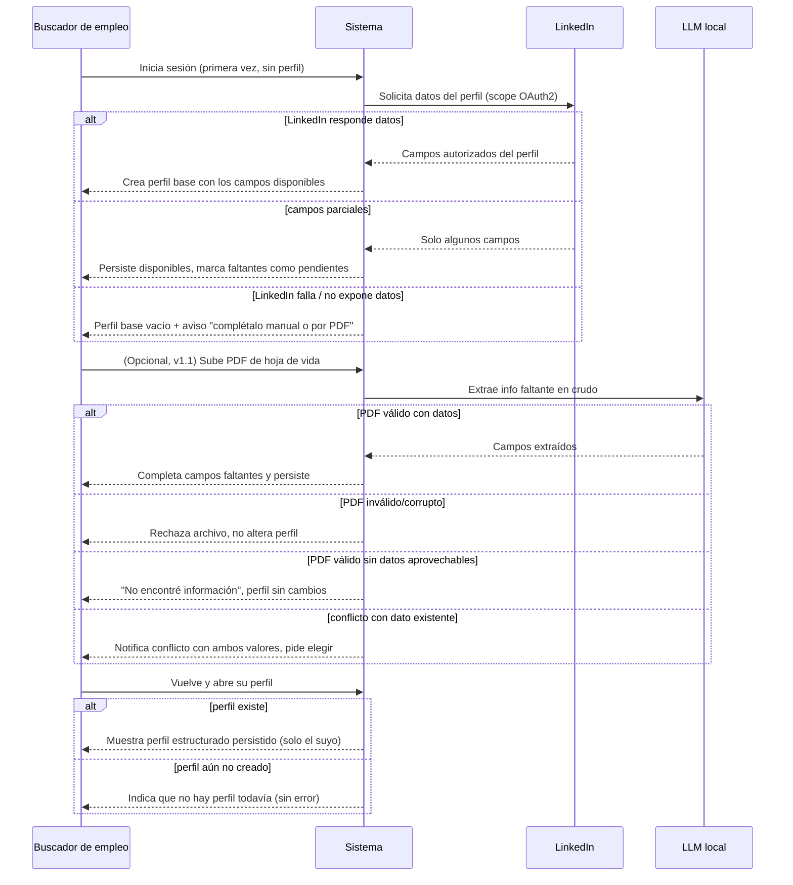

# Flow 003 — Ingesta y Perfil Base

## Resumen

Actor: **Buscador de empleo**. Objetivo: construir el perfil base automáticamente desde LinkedIn al entrar, complementarlo opcionalmente con un PDF (LLM local, v1.1) y consultarlo persistido. Condición de éxito: el usuario tiene un perfil estructurado sin captura manual.

## Diagrama

## Trazabilidad

| Paso | HU | AC |
|---|---|---|
| Perfil autopoblado desde LinkedIn | HU-007 | AC-1 (happy) |
| LinkedIn no devuelve datos → perfil vacío + aviso | HU-007 | AC-2 (error) |
| Campos parciales → persiste disponibles | HU-007 | AC-3 (edge) |
| PDF completa campos faltantes | HU-008 | AC-1 (happy) |
| PDF inválido/corrupto rechazado | HU-008 | AC-2 (error) |
| PDF contradice dato existente → conflicto | HU-008 | AC-3 (edge) |
| PDF sin info aprovechable | HU-008 | AC-4 (edge) |
| Recupera perfil persistido | HU-009 | AC-1 (happy) |
| Consulta de perfil inexistente | HU-009 | AC-2 (error) |
| Aislamiento del perfil entre usuarios | HU-009 | AC-3 (edge) |

## Notas

HU-008 está diferida a v1.1 (marcada en el flow como opcional); se incluye para completar la trazabilidad de la épica. Las 3 HU quedan cubiertas.
