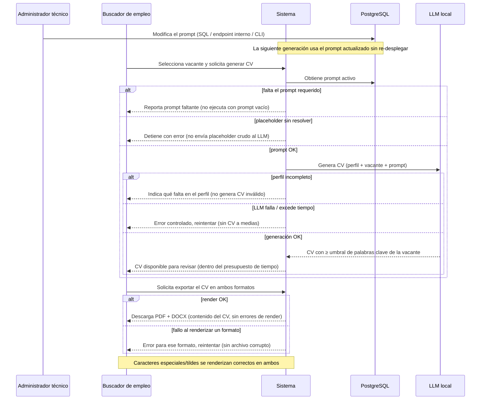

# Flow 005 — Generación de CV y Gestor de Prompts

## Resumen

Actores: **Buscador de empleo** (genera y exporta el CV) y **Administrador técnico** (gestiona los prompts en BD). Objetivo: producir un CV adaptado a la vacante con el LLM local, exportarlo en PDF/DOCX, usando prompts editables en caliente. Condición de éxito: el usuario descarga un CV adaptado sin costo de inferencia.

## Diagrama

## Trazabilidad

| Paso | HU | AC |
|---|---|---|
| CV generado con umbral de palabras clave | HU-013 | AC-1 (happy) |
| Falta info base del perfil | HU-013 | AC-2 (error) |
| LLM falla/excede tiempo | HU-013 | AC-3 (edge) |
| Generación dentro del presupuesto de tiempo | HU-013 | AC-4 (performance) |
| Descarga en PDF y DOCX | HU-014 | AC-1 (happy) |
| Fallo al renderizar un formato | HU-014 | AC-2 (error) |
| Caracteres especiales/tildes | HU-014 | AC-3 (edge) |
| Prompt editado aplica sin re-desplegar | HU-015 | AC-1 (happy) |
| Falta el prompt requerido | HU-015 | AC-2 (error) |
| Placeholder sin resolver | HU-015 | AC-3 (edge) |

## Notas

Se usan dos actores válidos del PRD §Stakeholders: Buscador de empleo (usuario primario) y Administrador técnico (operaciones/admin, gestión vía BD sin panel admin). Las 3 HU quedan cubiertas.
