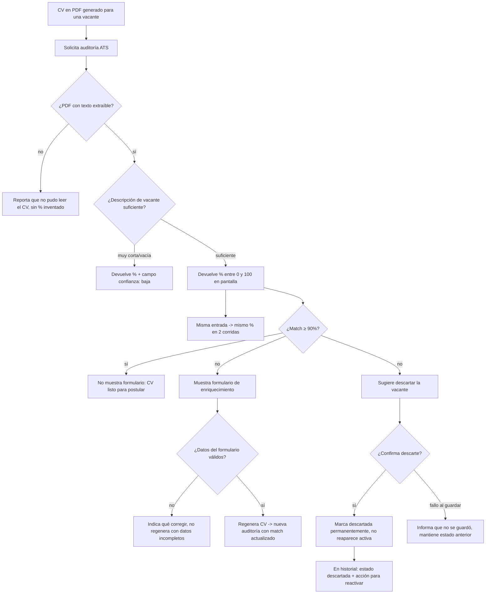

# Flow 006 — Auditoría ATS y Enriquecimiento

## Resumen

Actor: **Buscador de empleo**. Objetivo: auditar el CV contra la vacante (% match), y según la regla < 90% enriquecer o descartar, persistiendo toda decisión. Condición de éxito: el usuario sabe si su CV pasa el ATS y decide con la información persistida. Cierra el flujo end-to-end.

## Diagrama

## Trazabilidad

| Paso | HU | AC |
|---|---|---|
| Entrega % de match en pantalla (0–100) | HU-016 | AC-1 (happy) |
| PDF ilegible → sin % inventado | HU-016 | AC-2 (error) |
| Descripción corta → confianza: baja | HU-016 | AC-3 (edge) |
| Determinismo: misma entrada, mismo % | HU-016 | AC-4 (determinismo) |
| Enriquecer sube el match | HU-017 | AC-1 (happy) |
| Formulario con datos inválidos | HU-017 | AC-2 (error) |
| Match ≥ 90% no dispara formulario | HU-017 | AC-3 (edge) |
| Descartar persiste la decisión | HU-018 | AC-1 (happy) |
| Fallo al persistir el descarte | HU-018 | AC-2 (error) |
| Retomar una vacante descartada | HU-018 | AC-3 (edge) |

## Notas

`flowchart TD` porque domina la lógica de decisión (regla < 90% con ramas enriquecer/descartar). Consume el PDF de HU-014 (EP-005). Cierra el journey end-to-end. Las 3 HU quedan cubiertas.
